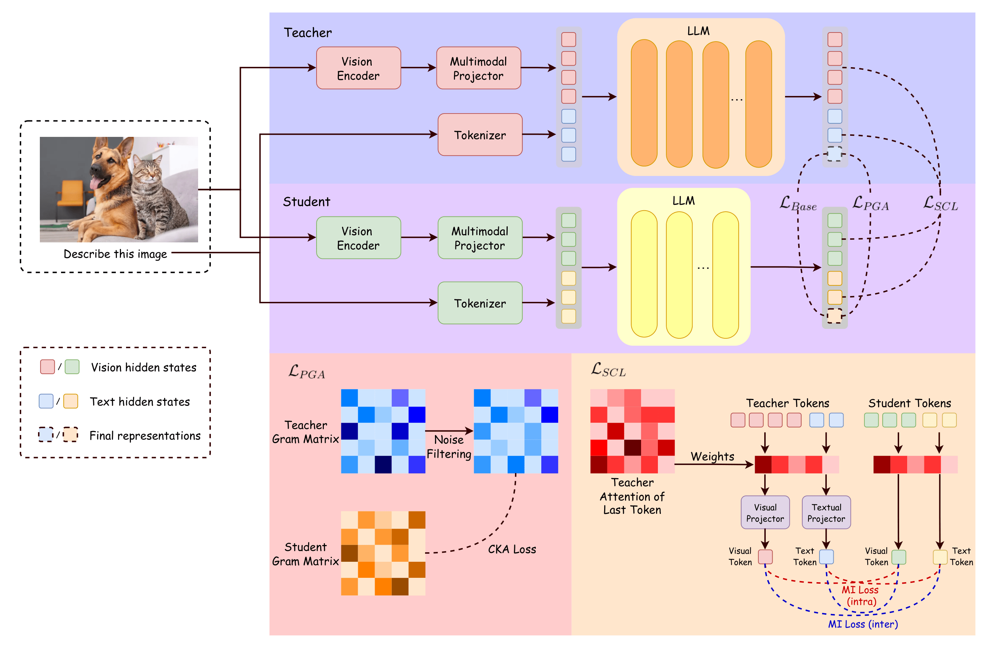
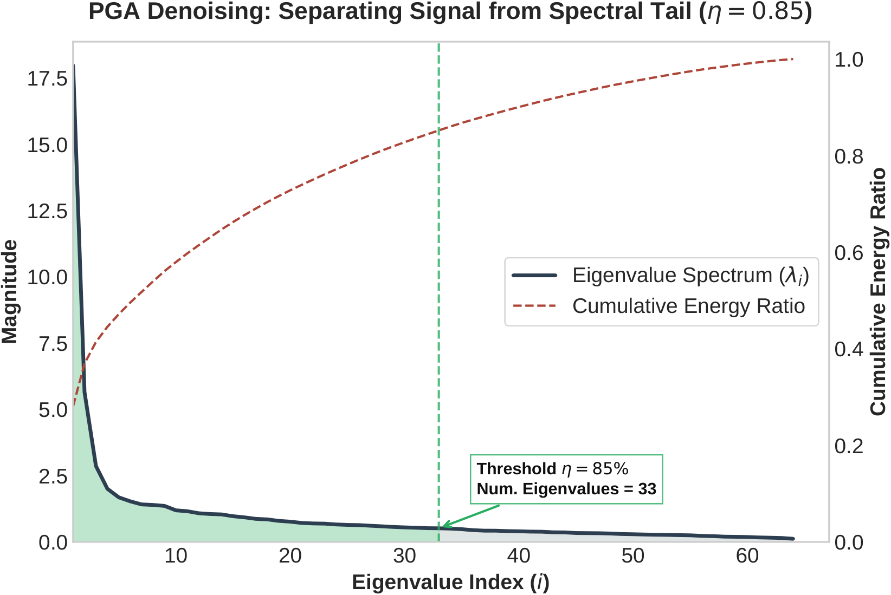
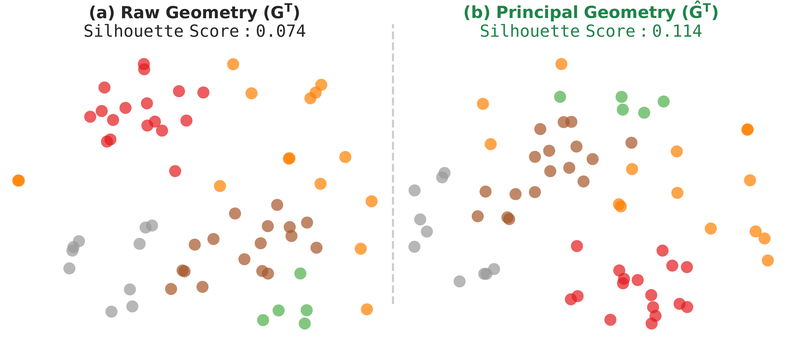

# PGA-KD: Principal Geometry Alignment and Semantic Consistency for VLM2Vec Distillation

Official PyTorch implementation of our EMNLP 2026 paper.

The-Anh Tran<sup>1</sup>\*, Thanh Xuan Nguyen<sup>1</sup>\*, Duc Anh Nguyen<sup>1</sup>, Dinh Viet Sang<sup>1</sup>, Linh Ngo Van<sup>1</sup>, Thien Huu Nguyen<sup>2</sup>

<sup>1</sup>Hanoi University of Science and Technology &nbsp;&nbsp; <sup>2</sup>University of Oregon &nbsp;&nbsp; \*equal contribution

---

Adapting large vision-language models for embedding tasks (VLM2Vec) is standard practice, but distilling them
into compact architectures remains hard: teacher and student differ in tokenization, hidden size, and in how
they mix modalities. PGA-KD addresses this with two complementary objectives:

- **Principal Geometry Alignment (PGA).** The teacher's batch Gram matrix is eigendecomposed and truncated to
  the top-*k* components carrying η of the total energy. The student is aligned to this denoised geometry
  through Centered Kernel Alignment, so it spends its limited capacity on the principal semantic structure
  instead of the spectral tail.
- **Semantic Consistency Learning (SCL).** Visual and textual features are pooled with the last token's
  attention map, then matched to the teacher through four InfoNCE pathways — two intra-modal (image-image,
  text-text) and two inter-modal (image-text, text-image) — which keeps the compact student from collapsing
  onto a single modality.

<p align="center">
  
  <br>
  <em>The PGA-KD distillation framework: InfoNCE + MSE anchor point-wise features, L<sub>PGA</sub> aligns the
  noise-filtered geometry, L<sub>SCL</sub> synchronises intra- and inter-modal dependencies.</em>
</p>

## Objective

```
L_total = L_InfoNCE + λ_MSE · L_MSE + λ_PGA · L_PGA + λ_SCL · L_SCL
```

where `L_PGA = 1 - CKA(G̃_S, G̃_T)` is computed against the truncated teacher Gram matrix and
`L_SCL = L_intra + L_inter` sums the four alignment pathways. Both live in
[`src/criterions/pga.py`](src/criterions/pga.py).

<p align="center">
  
  <br>
  <em>With B = 64, the top 33 eigenvalues already cover η = 85% of the teacher's energy; the rest is the
  spectral tail PGA drops.</em>
</p>

<p align="center">
  
  <br>
  <em>Filtering that tail raises the Silhouette score of the batch geometry from 0.074 to 0.114.</em>
</p>

## Results

MMEB averages with **B3-Qwen2-2B** as teacher (d<sub>T</sub> = 1536) and 0.5B students (d<sub>S</sub> = 896).
Per-dataset scores, OOD results, ablations and runtime are in [docs/RESULTS.md](docs/RESULTS.md).

**FastVLM-0.5B student, in-distribution**

| Method | Classification | VQA | Retrieval | Grounding |
| ------ | -------------- | --- | --------- | --------- |
| Teacher | 77.4 | 62.3 | 72.9 | 70.5 |
| Student | 64.7 | 50.8 | 55.8 | 65.0 |
| MSE | 65.0 | 51.3 | 56.9 | 68.3 |
| RKD | 66.2 | 51.3 | 55.9 | 68.1 |
| CKD | 66.1 | 51.4 | 56.2 | 68.7 |
| EMO | 63.9 | 50.8 | 24.3 | 66.8 |
| EM-KD | 64.3 | 51.5 | 57.3 | 69.2 |
| **PGA-KD** | **69.4** | **54.0** | **60.2** | **69.5** |

**LLaVA-OneVision-0.5B student, in-distribution**

| Method | Classification | VQA |
| ------ | -------------- | --- |
| Student | 65.9 | 36.6 |
| CKD (best baseline) | 66.9 | 40.3 |
| **PGA-KD** | **70.4** | **41.0** |

Gains are largest on reasoning and retrieval (OK-VQA +8.8, VisDial +12.1 over the student). They are flat on
DocVQA and negative on ChartQA: filtering the low-energy tail trades fine-grained textual detail for a
cleaner global structure. Raising η to 0.95 recovers the best DocVQA score when the target workload is OCR-
or document-heavy.

## Setup

```bash
python -m venv vlm
source vlm/bin/activate
pip install -r requirements.txt
python fix_lib.py
```

`fix_lib.py` patches `transformers/models/qwen2_vl/image_processing_qwen2_vl.py`, which otherwise rejects the
teacher's image batches during distillation.

Experiments were run on 8× A100 80GB with bf16 and DDP. All students are trained with LoRA, so a single node
is enough to reproduce any track.

## Data

Training and evaluation both use [MMEB](https://huggingface.co/datasets/TIGER-Lab/MMEB-train).

```bash
# ~20 training subsets -> vlm2vec_train/MMEB-train/images
python download.py

# evaluation images
wget https://huggingface.co/datasets/TIGER-Lab/MMEB-eval/resolve/main/images.zip
unzip images.zip -d eval_images/ && rm images.zip
```

## Training

One script per (meta-task, student). Each sets its LoRA rank, batch size and loss weights, then calls
`main.py` through `torchrun`.

```bash
bash scripts/cls/train_PGA_fastvlm.sh              # classification
bash scripts/vqa/train_PGA_fastvlm.sh              # VQA
bash scripts/retrieval/train_PGA_fastvlm.sh        # retrieval
bash scripts/grounding/train_PGA_fastvlm.sh        # grounding

bash scripts/cls/train_PGA_llava_onevision.sh      # same tasks, OneVision student
```

Baselines follow the same layout in every task folder: `train_student.sh` (no distillation), `train_MSE.sh`,
`train_RKD.sh`, `train_CKD.sh`, `train_EMO.sh`, `train_EMKD.sh`. Per-track hyperparameters are listed in
[docs/TRAINING.md](docs/TRAINING.md).

The knobs worth touching first:

| Flag | Value used | Meaning |
| ---- | ---------- | ------- |
| `--kd_loss_type pga` | – | selects `PGAKDLoss` |
| `--pga_loss_weight` | 2.0 | λ<sub>PGA</sub> |
| `--pga_scl_loss_weight` | 0.01 | λ<sub>SCL</sub>, kept small so the four sub-losses do not dominate |
| `--pga_mse_loss_weight` | 1.0 | λ<sub>MSE</sub> |
| `--pga_spectral_variance_threshold` | 0.85 | η, the cumulative energy kept after truncation |

## Evaluation

Point `EXP_NAME` in the script at the checkpoint you want to score, then:

```bash
bash scripts/cls/run_eval.sh
bash scripts/vqa/run_eval.sh
bash scripts/retrieval/run_eval.sh
bash scripts/grounding/run_eval.sh
```

Each script launches `eval_mmeb.py` with `accelerate` over the subsets of that meta-task and writes encodings
and scores to `eval_outputs/$EXP_NAME`. To collect several runs into one table:

```bash
python scripts/parse_eval_results.py
python scripts/compare_performance.py
```

## Models

| Role | Architecture | Checkpoint | Hidden dim |
| ---- | ------------ | ---------- | ---------- |
| Teacher | Qwen2-VL-2B + Qwen2-VL ViT | `raghavlite/B3_Qwen2_2B` | 1536 |
| Student 1 | FastVLM + MobileCLIP-L | `apple/FastVLM-0.5B` | 896 |
| Student 2 | LLaVA-OneVision + SigLIP-SO400M | `llava-hf/llava-onevision-qwen2-0.5b-ov-hf` | 896 |

## Layout

```
main.py                  distillation entry point
eval_mmeb.py             MMEB evaluation
src/criterions/pga.py    PGA + SCL losses and the SCL projectors
src/criterions/          baselines: mse, ckd, holo, emo_loss, em_kd, contrastive_loss_with_RKD
src/distiller.py         teacher/student wrapper and projector setup
src/model/               VLM2Vec model and backbones
scripts/<task>/          training and evaluation scripts per meta-task
config/                  DeepSpeed and projector configs
docs/                    full results and training reference
```

## Citation

```bibtex
@inproceedings{tran2026pgakd,
  title     = {{PGA-KD}: Principal Geometry Alignment and Semantic Consistency for {VLM2Vec} Distillation},
  author    = {Tran, The-Anh and Nguyen, Thanh Xuan and Nguyen, Duc Anh and
               Sang, Dinh Viet and Van, Linh Ngo and Nguyen, Thien Huu},
  booktitle = {Proceedings of the 2026 Conference on Empirical Methods in Natural Language Processing},
  year      = {2026}
}
```

## 🙏 Acknowledgements

We acknowledge the following open-source projects that served as the foundation for our work:

* [VLM2Vec](https://github.com/TIGER-AI-Lab/VLM2Vec) for the embedding framework and MMEB benchmark.
* [B3-Qwen2](https://github.com/raghavlite/B3) for the teacher model architecture.
* [FastVLM](https://github.com/apple/ml-fastvlm) for the efficient student architecture.
